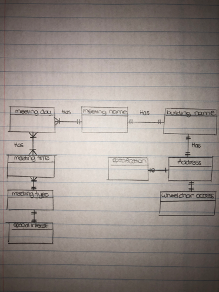
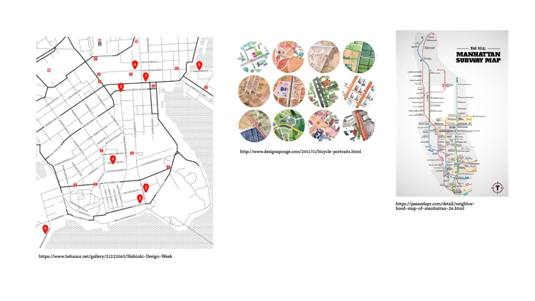
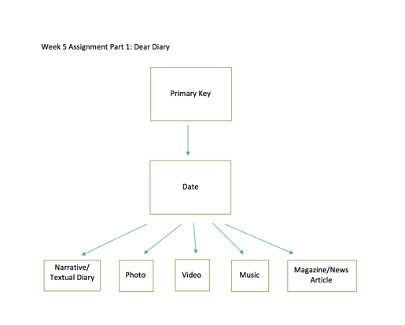
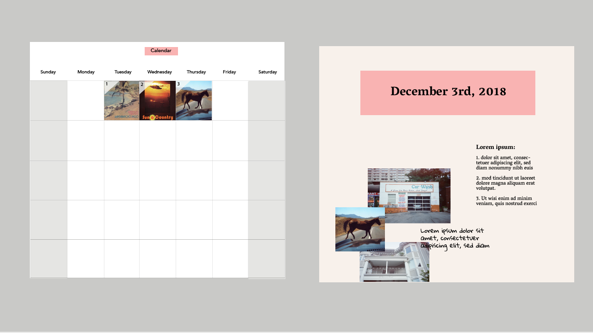
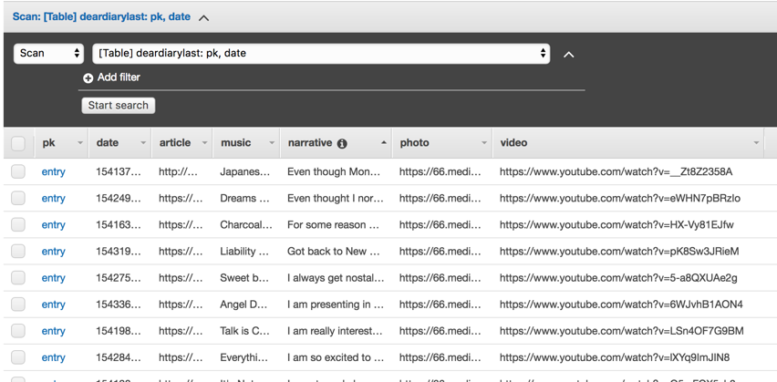
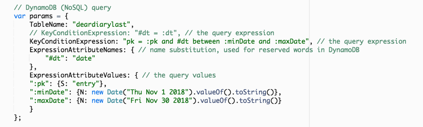
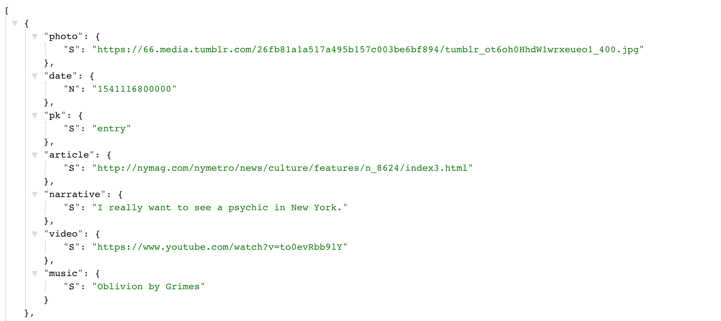

## Final Assignment Documentation 

### Assignment #1: AA Meetings

##### For first final assignment, we were required to scrape data from New York’s AA Meeting list and then clean, store and visually represent the data on a map. In the first week, I used Node.js to make a request for the 10 different zones from the “Meeting List Agenda”, specifically for Manhattan. Once the files were saved, I extracted the data and stores the contents of one of the zones in a variable. We were each assigned a single zone to scrape the data and clean, which we would then share with each other to complete all ten zones. In this stage, I sketched out my data structure which is represented by the data model below. However, as the project evolved, the data model did as well. 

##### Once I was finished parsing the data from the single zone, I made a request to the Texas A&M Geoservices Geocoding API’s for each address within that zone. Due to the messy nature of the addresses that were returned, I needed to parse the code to make it ready for the API queries. For example, some of the addresses did not have street names or included a range of street numbers which would not return latitude and longitude values. 

##### Using the AWS RDS Postgres database, I created a table to store the locations from the AA Meeting data. Once the table was created, I used the pg module to insert the data and populate my database. I then wrote and executed a query to filter the meetings on Thursdays and Fridays that start at 5:00pm. 

##### Through collaborating with other classmates, I was able to parse and clean the data from all ten zones and input that data into a JSON file. My final query looked like this:

##### For the visual representation, I used leaflet to bind the data points onto a map of Manhattan.  I included imagery of inspiration that I wanted to use to design my map however, due to a lack of time did not get to implement these design features. My final map included a market pop up for each location which displayed the data from the query. In the future, I would like to go back and style the text within the popup to not be in a JSON format. Ideally, I would also like to be able to have the user filter the popup markers by meeting time and type. 

### Assignment #2: Dear Diary 

##### For our second final assignment, we were asked to create a “diary” where we collected data on a daily basis and inputted the data into a table, which we would then visually represent. My concept for my diary came about because I realized I was bookmarking several websites, photos and videos that I found interesting on a daily basis however, would never go back and view those bookmarks. After months of gathering URL’s, I did not have a way to organize the information and therefor, would never go back to look at it. Thus, my dear diary project would act as a “catalogue”, holding all the media that I found interesting on that specific day in the form of a calendar. By combing various mediums such as text, image, video and music, I wanted to create a calendar in which each day would represent how I was feeling or what I was inspired by. The calendar would ultimately act as a visual and textual diary that can be used to both communicate emotion and interests but also to see patterns in feelings throughout the month. 

##### Throughout the month of November, I wrote one piece of text that described my “mood” that day and then accompanied it with a news article, image and video (sometimes the different mediums did not relate to my mood). Due to the nature of the data being in various formats such as photo and video, I chose to create a NoSQL database using Amazon DynamoDB. To create this database, I first created a normalized data model for my table which can be seen below. I started with my primary key, which then lead to “date” and from each date it leads to the various mediums for that day. 

##### Throughout the process of creating the data model, I realized the importance of having a conceptual idea of the visualization before structuring the model. Thus, during the process of creating the model, I also sketched out the visual interface of the data which can be seen below. The landing page is simply a calendar of November and the background of each day is represents the image that was chosen on that specific day. I also wanted the user to be able to click on that day and be lead to another page which would be like a blog style and be able to read about the different types of media I was inspired by that day and hopefully get a sense of my mood on that specific day.  

##### It is important to point out that as I began querying my data and thinking of the visualization, I chose to change my data model, specifically the number of mediums I was representing as well as the primary and sort keys. I originally did not want to include all five mediums everyday however, as I was writing the code to insert my data into the table, I realized that having the mediums be consistent throughout the month would help with simplicity. After creating the data model, I then created a table in Dynamo DB with a specific primary key as well as a sort key which would be later used to organize the output of my table. The table was structured with a primary key being “pk” which I called “entry”. Then I decided to use the date as my sort key because I would want to sort through all of my diary entries and arrange them by the day of the month. Due to the fact that all of the mediums resided on the same level within the data model, I did not create a strict hierarchy within the different mediums and the order of them was arbitrary. 

##### In order to give each item a value and store them in an array, I used the “putItem” method in AWS SDK for JavaScript in Node.js. I then used AWS SDK to populate the database with the data I had collected throughout the past month. Once the database was populated, I wrote and executed a query based on the information I wanted to visualize. I wanted to filter through my diary entries by date because I knew my final visualization would look like a calendar which heavily relies on date as the sorting factor. I decided to write a NoSQL query that would provide me with a range of data between November 1st and November 30th. I found this query to be efficient at giving me only the values between those specific days however, it did not sort the values from the start of the month to the end of the month. 

##### When binding the data to the visual representation, I made the decision to include all of the information however, not visually represent every data point. For example, I visually represented the photo data by converting the links to the photos, into actual images for the background of the calendar. Although I had the intention of doing the same thing with the videos, I did not have time to execute this idea. Thus, I simply kept the rest of the data in a textual format and included it when the user hovers over the image. I was also unable to create the visualization using dynamic data and simply used static data that I put into a separate JSON file. If I were to continue this project in the future, I would want to continue collecting data every day and simply create more monthly calendar spreads for an entire year. 

### Assignment #3: Light Sensor

##### For Assignment #3, we were asked to generate data over the course of a four-week period, using a specific sensor and then visualize the information we collected. The sensor I chose to work with was a photoresistor which measured the intensity of light. I placed the photoresistor in my studio apartment and wanted to see how much light was in my apartment at various time of the day, including when I was asleep. I was specifically interested in looking at the values during the nighttime because I wanted to see how often I woke up in the middle of the night and went on my computer or phone. However, as the project evolved, I realized that the sensor was picking up on other interesting trends, such as the time I woke up in the morning and the time of sunset. 

##### In order to read the brightness levels of the sensor, I first registered a Particle variable with the cloud. I then wrote a loop to check and see the value of the sensor which would then store that value in a variable. Using a starter code provided in combination with Web IDE, I was able to see the values of the sensor throughout the testing period. I then set up a single variable in a string which included the value of my sensor. This value was accessible through a URL I created that retrained the JSON data from the Particle cloud API. 

##### My original sketch for the visualization represented the average intensity of light for every hour of the day for 14 days.  The days were represented on the x axis and the hours of the day on the y axis. Each circle represented an hour of the day and the color of the circle ranged depending on the value collected. I originally wrote a query to receive this specific data however, in the end I chose to only visualize the average of every hour over the entire collection period. 

query image

##### My decision to change the visualization and query was simply out of a lack of time however, in the future I hope to build my original sketch. The final interface design of my sensor data was represented as a bar chart with the hour of the day on the x axis and the value of the intensity of light on the y axis. 

